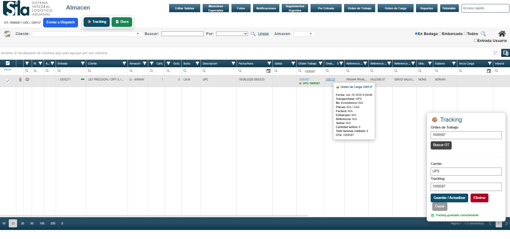

# JD Automation

Operational automation suite designed to improve efficiency, visibility and workflow management inside SILA.

---

## Overview

JD Automation is a collection of internal tools created from real operational challenges in logistics, distribution and warehouse environments.

The objective is simple:

- Reduce repetitive work
- Eliminate manual processes
- Improve visibility
- Increase operational efficiency
- Create scalable operational workflows

Built and maintained by Miguel Soto.

---

## Screenshots

### SILA Operations Toolkit

Integrated operational tools running directly inside SILA:

-  Tracking Management
-  Document Access
-  Dispatch Integration
-  Intelligent ODC Hover Information
-  Workflow Enhancements

---

## Modules

###  JD Intake Lite

Truck Log importer for SILA Pre Entrada.

Features:

- Excel Truck Log import
- Automatic line creation
- Multi-reference support
- Combined-cell processing
- Pallet and box detection
- Operational validation

---

###  SILA Tracking + Docs

Tracking and document visibility toolkit.

Features:

- Tracking storage and management
- Carrier identification
- Quick document access
- ODC hover details
- Operational visibility improvements

---

###  Dispatch Integration

Direct connection between SILA and JD Flow.

Features:

- Send to Dispatch button
- Automatic order creation
- Workflow status tracking
- Dispatch visibility
- Cross-team coordination

---

## Technology Stack

- JavaScript
- Tampermonkey
- GitHub
- Supabase
- Hostinger Horizon
- SILA Integration

---

## Installation

### JD Intake Lite

Install:

https://raw.githubusercontent.com/SotoJr/jd-automation/main/intake/jd-intake-lite.user.js

### SILA Tracking + Docs

Install:

https://raw.githubusercontent.com/SotoJr/jd-automation/main/tracking/sila-tracking-docs.user.js

### Dispatch Integration

Install:

https://raw.githubusercontent.com/SotoJr/jd-automation/main/dispatch/sila-enviar-dispatch.user.js

---

## Operational Impact

Current measured results:

- Average processing time before automation:
  - 43 minutes 45 seconds

- Average processing time after automation:
  - 22 minutes 55 seconds

- Improvement:
  - Approximately 48%

---

## Roadmap

### In Progress

- GitHub release management
- Documentation improvements
- User deployment standardization

### Planned

- OCR document search
- Executive KPI dashboard
- Role-based filtering
- Machine learning shipment classification
- Customer operational profiles

---

## Related Projects

###  JD Flow

Internal dispatch workflow platform focused on:

- Document visibility
- Dispatch management
- Operational traceability
- Audit history
- KPI dashboards

###  Pulso Marketing

Digital marketing and automation solutions for local businesses.

###  Fill Class AI

Attendance automation platform for fitness businesses.

---

## Author

Miguel Soto

Operations Automation • Process Improvement • Internal Tools Development

Tijuana, Baja California, Mexico
